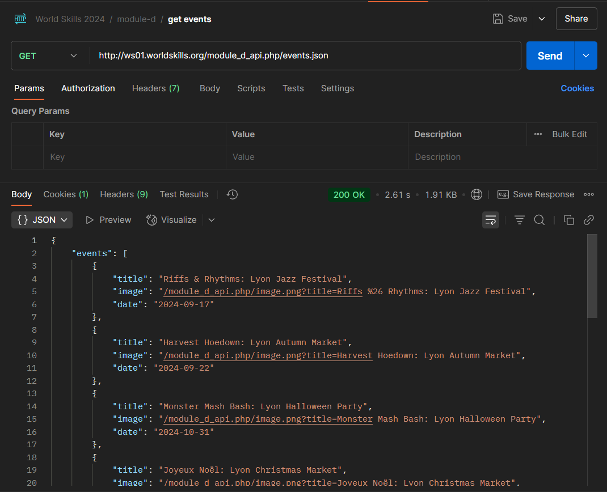

# Module D - Lyon Mobile Services

- Name: Ketsadaphone BOUTPANYDA
- Nationality: Laos
- Role: Expert
- Seatnumber: 16

## 1. Instrutor for Inspector

This project using Vite + React template.

### 1.1 Library that use in this project

1. axios
2. react-router-dom

### 1.2 How to run this project

In this compettion I use monorepo architecture for better practice organize my folder in my project. because I want to make the node_modules can use in every test project (TP).

here is run command:

```bash
npm run dev:module-d:frontend
```

### 1.3 How to build this project

As you know I use monorepo architecture. the build command are look like the same as the dev command because I have config in root level of my main folder in package.json. you can check it and you see some config of script and more.

here is build command:

```bash
npm run build:module-d:frontend
```

## 2. Project Config

in the `vite.config.js` I have config the base path and asset output for make it working on vm server. for example: access the out of this project to this url `ws16.worldskill.org/module-d`

here is the config code:

```javascript
//vite.config.js

import { defineConfig } from "vite";
import react from "@vitejs/plugin-react";

// https://vitejs.dev/config/
export default defineConfig({
  plugins: [react()],
  base: "/16_module_d/",
  build: {
    assetsDir: "assets",
  },
});
```

## 3. Frontend Config

### 3.1 Media Query Breakpoint

- Mobile : <= 478px
- Tablet : <= 768px
- PC: > 768px

## 4. Backend Access

You access the backend api via browser or API testing tool like Postman with this endpoint url `http://ws01.worldskills.org/module_d_api.php`

example image:


